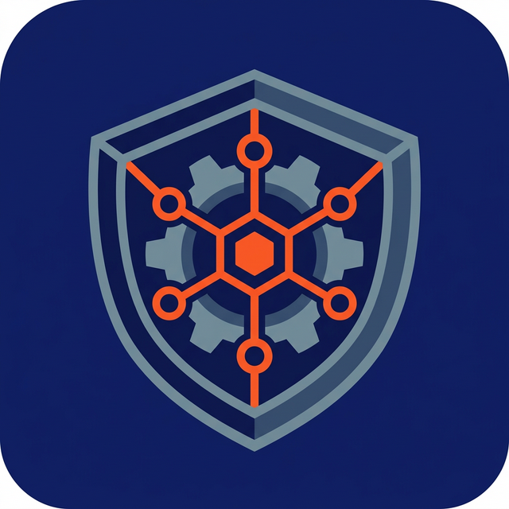
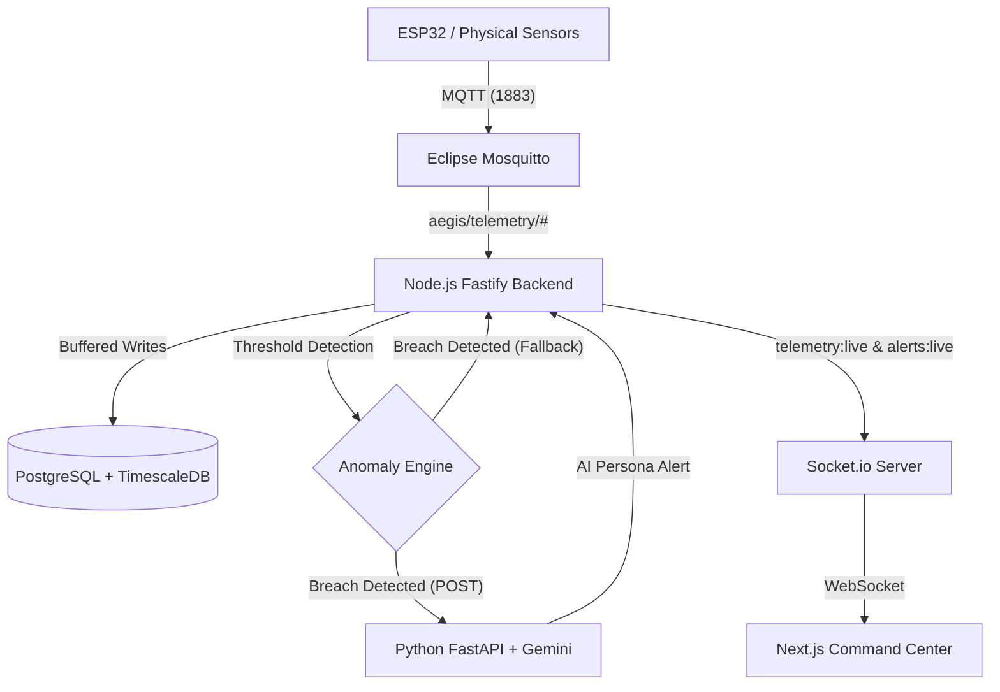

<div align="center">
  
  <h1>Aegis Node</h1>
  <p><strong>Predictive Machine Maintenance with an AI Conversational Voice</strong></p>
</div>

---

Aegis Node is an enterprise-grade, offline-first IoT predictive maintenance platform. It ingests high-frequency telemetry data from industrial machines, performs real-time sliding-window anomaly detection, and gives physical machines a sentient "voice" via Large Language Models to alert factory floor workers of critical issues.

## 🚀 Features

- **High-Frequency Ingestion**: MQTT broker architecture capable of handling rapid sensor telemetry.
- **Microservices Architecture**: Strictly separated boundaries (Fastify MQTT consumer, Python AI engine, Next.js Command Center).
- **ML Anomaly Engine**: Leveraging `scikit-learn` in Python to run unsupervised **Isolation Forest** models on telemetry windows for advanced anomaly detection.
- **Predictive Trends**: Background scheduling service that analyzes long-term TimescaleDB data to predict machine failure before it happens.
- **Agentic Machine Personas**: Google Gemini generates human-like, machine-first messages to explain technical failures to workers.
- **Veteran Worker Experience**: A dedicated mobile-first PWA (`/worker`) with a plain-English SMS chat interface, voice-to-speech (TTS) playback, and actionable status buttons.
- **Offline-First Resilience**: Local Fastify backend gracefully falls back to structured templates if the AI service or internet is interrupted.
- **TimescaleDB Optimization**: Built on PostgreSQL + TimescaleDB for highly optimized time-series data storage.

## 🛠️ Tech Stack

| Component          | Technology                  | Description                                                          |
| ------------------ | --------------------------- | -------------------------------------------------------------------- |
| **Backend**        | Fastify + TypeScript        | High-performance Node.js API and MQTT processing engine.             |
| **Database**       | PostgreSQL 16 + TimescaleDB | Time-series optimized hypertable storage.                            |
| **ORM**            | Drizzle ORM                 | Type-safe SQL-first queries and migrations.                          |
| **Message Broker** | Eclipse Mosquitto           | Lightweight MQTT broker for IoT device ingestion.                    |
| **AI Service**     | FastAPI + Python            | Asynchronous microservice wrapping Gemini and `scikit-learn`.        |
| **LLM Engine**     | Google Gemini 2.0 Flash     | Ultra-fast context and persona generation.                           |
| **ML Engine**      | Isolation Forest            | Unsupervised anomaly detection for complex telemetry patterns.        |
| **Frontend/PWA**   | Next.js 16 + Tailwind CSS   | React Server Components dashboard with a dedicated mobile PWA route. |
| **Real-Time**      | Socket.io                   | WebSockets for live telemetry charting and instant alert dispatch.   |

## 🏗️ Architecture & Data Flow



## 🏁 Quick Start (Live Demo)

This monorepo comes with a built-in IoT simulator to instantly demonstrate the real-time capabilities without needing physical hardware.

**1. Infrastructure (PostgreSQL & Mosquitto)**

```bash
docker compose up -d
```

**2. Backend Service (Port 3001)**

```bash
cd apps/backend
npm install
npm run dev
```

**3. AI Microservice (Port 8000)**
First, add your `GEMINI_API_KEY` to the root `.env` file.

```bash
cd apps/ai-service
python3 -m venv venv
source venv/bin/activate
pip install -r requirements.txt
uvicorn app.main:app --reload --port 8000
```

**4. Command Center Dashboard (Port 3000)**

```bash
cd apps/command-center
npm install
npm run dev
```

**5. Start the IoT Engine**
In a new terminal, launch the simulator to start streaming data into the Mosquitto broker:

```bash
npx tsx tools/simulator.ts
```

> **Dashboard**: Navigate to [http://localhost:3000](http://localhost:3000) for the main operator view.
> **Worker PWA**: Navigate to [http://localhost:3000/worker](http://localhost:3000/worker) to see the mobile-optimized AI alert feed.

## 🔌 Hardware Integration

Aegis Node is ready for physical hardware out of the box.

Point any ESP32, Arduino, or PLC to `mqtt://<your-laptop-ip>:1883` and publish JSON payloads to `aegis/telemetry/[machine_name]`:

```json
{
  "machineId": "CNC_Lathe_01",
  "vibrationRms": 3.42,
  "tempC": 42.1
}
```
